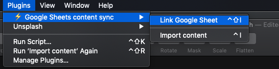
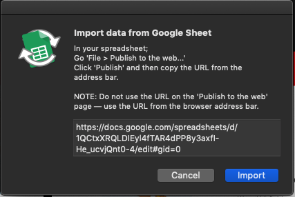

Edit and collaborate on your content in Google Sheets, then sync in back to your sketch files.

## Usage

### TL;DR
1. Create a Google Sheet.
    - Create a header row on the first row of the table:
      - Add the following in the first two columns 
        | **Key** | **Value** |  -- *like screenshot above*
    - Enter content in rows with the __lookup key__ in column A and the __content__ in column B.

2. Publish it with `File > Publish to the web... > Publish`
3. Name text layers appropriately — e.g. `text layer #title`
4. Download plugin - https://github.com/maths-no-problem/Google-sheets-content-sync-sketch-plugin/archive/master.zip
5. Unzip and install Plugin by clicking on ***Google sheets content sync.sketchplugin***
5. setup Google Sheet linking - `control + shift + i` > copy the url for published google sheet into modal.
4. Run the plugin — `control + i`

----
## If Spreadsheet hasn't been created yet.

### 1. Create your Spreadsheet 

Create a new Google Spreadsheet

Enter your content going vertically, with the titles on the first column, and the values directly beside it. **Note: It is very important that you do it this way**

### 2. Publish the sheet

Next you need to publish the document, so that Sketch can read it's contents via the shareable link.

Do this by going `File > Publish to the web... > Publish`

### 3. Name your layers

Now that the spreadsheet is accessible — how do you tie specific values to your layers?

**It all comes down to how you name your layers**

In the name of a layer, add a '#' followed by the title in the spreadsheet.

For example: to tie the value of 'title' to a Text Layer, give it a name like `#title`

Spreadsheet Data | Sketch Layer list
:---:|:---:
 | 

> It is not case-sensitive, and will ignore spaces — so `headline #title` will still get the value for `Hmmm, something doesn't add up.`, you can also have other naming before the '#'. So `layer name #title` and `#title` would both work equally.

**Different Sheets**

If you would like to tie the data to a specific sheet within the Google Spreadsheet, add the sheet name to your Sketch page, otherwise it will default to the first page. *(Note: Only one Google sheet, per a Sketch page)*

Spreadsheet Sheets | Sketch Page list
:---:|:---:
 | 

## Setup Plugin on sketch
### 1. Download plugin 
1. https://github.com/maths-no-problem/Google-sheets-content-sync-sketch-plugin/archive/master.zip
2. unzip download.
3. click on ***Google sheets content sync.sketchplugin*** to install plugin

### 2. Link Google Sheet
1.  `Plugins > Google Sheet content sync > Link Google Sheet`
    
2. Get the Google Sheet URL and copy URL into the text field in this modal.
    
3. Click **Import**

### 3. Run the plugin

<kbd>⌃ control</kbd> + <kbd>i</kbd> to **import** the values from a spreadsheet. A popup alert will appear, allowing you to enter the URL of your Google Sheet. **Important: Use the URL of your Google Sheet in the browser address bar, DO NOT use the URL generated after clicking 'Publish to the web'.**

Then click `Import`. That's it! 🎉 The content should magically populate.

Anytime you want to re-sync the values, run the plugin again!

